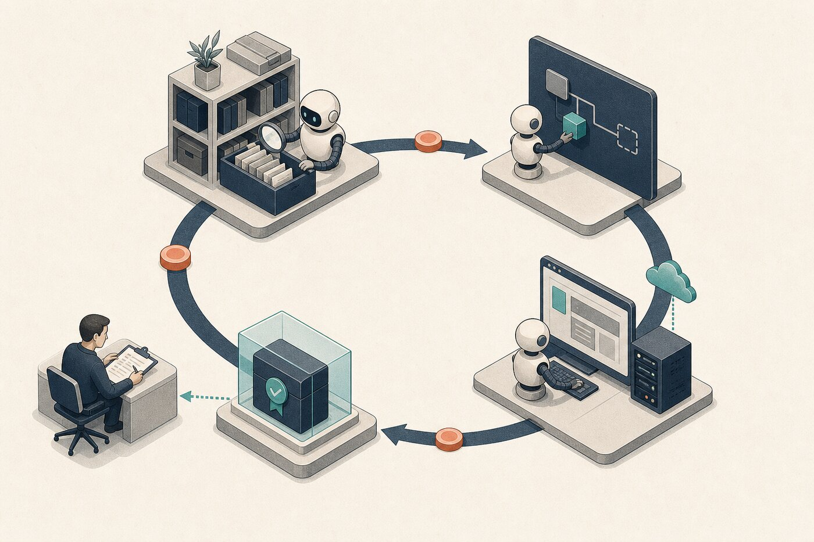

# Route Work Through Patpat



Patpat turns an outcome into a closed engineering loop:

```text
FRAME -> INSPECT -> PROOF CONTRACT -> ACT -> VERIFY
VERIFY -> REPORT when local reversible without delivery intent
VERIFY -> REVIEW before delivery / high-risk / durable-run LEARN|REPORT
REVIEW -> LEARN? -> REPORT
```

## State the outcome

Tell Patpat what must be true, what must stay unchanged, and what observation would convince you. Avoid prescribing internal steps unless the order is itself a requirement.

```text
/patpat reduce this import from 40 seconds to under 10 without changing the output rows. Measure the same fixture before and after.
```

That prompt contains a target, a preserved contract, and a comparable measurement. The router can select the performance playbook without guessing.

## Let the router narrow the work

Patpat distinguishes investigation, defect repair, architecture, bounded change, refactor, performance, visual equivalence, durable execution, and delivery. It copies the selected playbook into the working plan and loads detail only when a step needs it.

Call a focused skill directly only when the task is already narrow:

```text
Use patpat-inspect to trace who owns this cache invalidation. Read-only.
```

## Inspect before committing to a story

Patpat reads the minimum safe repository context, nearby contracts, git state, and relevant history. It separates confirmed evidence from inference. When docs and verified behavior conflict, repository behavior wins and durable docs are corrected only when the project truth changed.

## Name the proof before editing

A proof contract records:

- the claim being made;
- the authoritative surface;
- the action that exercises it;
- the expected observation;
- cleanup and safety constraints.

The contract makes proxy substitution visible when the workflow follows it. `patpat-run` enforces the `PROOF_CONTRACT -> ACT` transition inside its state machine; it does not intercept arbitrary host tool calls.

## Control delivery explicitly

Explicit Patpat activation authorizes the loop, proof, and verify. Default commit-and-PR requires delivery intent. It does not permit merge, deploy, package publication, secret rotation, or risky auth, billing, and permission changes by implication.

Say `local only` to keep the work unshipped. Say `pause safely` to preserve resumable state without opening a pull request. Say `land` or `merge` only when you intend to authorize a green reviewed pull request to merge.

Next: [Understand and design](./03-understand-and-design.md).
