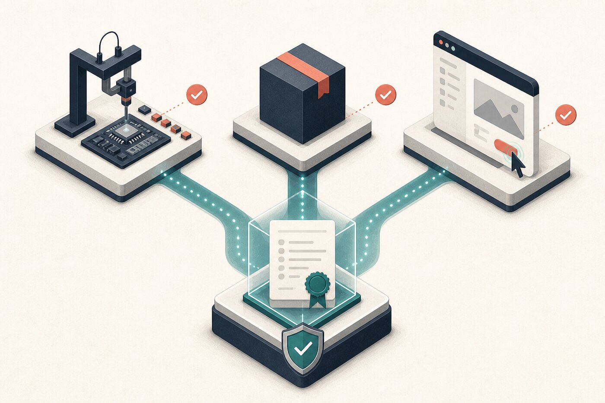

# Build, Debug, and Verify



Generation is cheap. Evidence is the scarce resource. Patpat shapes the implementation around the strongest practical observation of changed behavior.

## Make the smallest safe change

Inspect the target and nearby contracts, then stop at the first solution that works:

1. delete obsolete behavior;
2. reuse repository code;
3. use a platform or standard-library primitive;
4. use an existing dependency;
5. add one local patch;
6. add a new abstraction only when the earlier rungs cannot express the requirement.

Preserve unrelated behavior and leave unrelated dirty files untouched.

## Reproduce defects before fixing them

A defect workflow starts with the failure on an authoritative surface. Trace from symptom to cause, then write the cheapest deterministic regression check that proves the failure when practical.

```text
/patpat reproduce the duplicate write through the real retry path. Add a focused regression test if it can exercise the same contract, then fix the root cause and rerun both surfaces.
```

Do not force a brittle mocked test when the real command is faster and more trustworthy.

## Use a proof ladder

Run checks from narrow to broad:

1. targeted behavior or regression test;
2. build, typecheck, and lint for the changed surface;
3. package or integration check;
4. manual or automated smoke on the real application;
5. production-like observation when the risk requires it and authority exists.

Higher rungs do not erase failures below them. A build proves compilation. It does not prove a user flow, stored value, network contract, or performance target.

## Bind evidence to the current artifact

Record the command or action, result, and relevant artifact identity. Durable runs bind receipts to current content so stale evidence cannot approve a changed tree.

Use exact reporting language:

- `verified` when the relevant checks passed;
- `partially verified` when only part of the proof contract ran;
- `implemented but not verified` when no practical check ran;
- `not implemented` when no change was made.

Next: [Review and ship](./05-review-and-ship.md).
