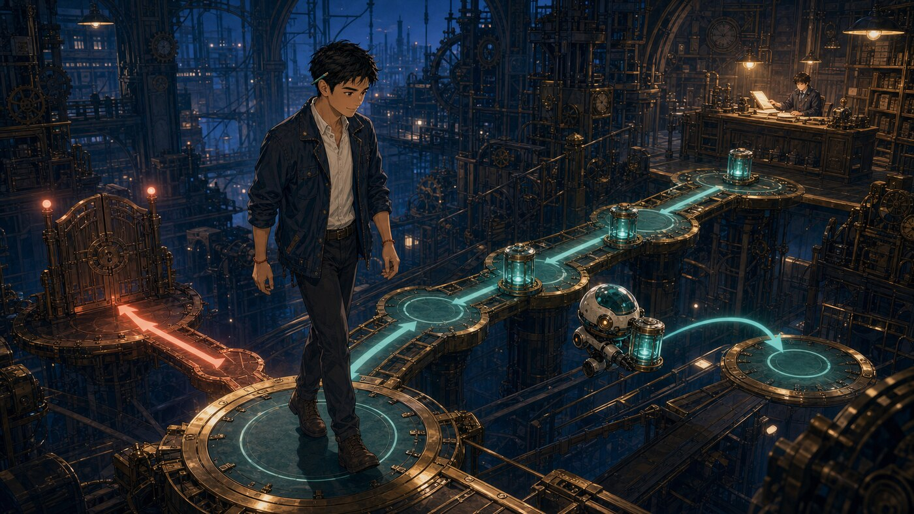

# Run Durable Work



Long work needs explicit state, not a longer prompt. `patpat-run` models phases and evidence as a deterministic local graph that can stop, resume, and reject stale proof.

## Use a graph when continuity matters

Choose a durable run when the task spans sessions, has dependent phases, needs checkpoints, or may be handed to another agent. Keep a bounded task in the normal loop; state machinery is overhead when one verified patch will finish the job.

## Define the finish condition

A duration is not a finish condition. State an observable predicate:

```text
/patpat keep working until every migration fixture passes against a clean database and the rollback restores the original schema. Pause safely on the third identical blocker.
```

The run can check that condition after each phase. It must not relax the condition to manufacture completion.

## Advance only with current evidence

The graph refuses:

- implementation without a proof contract;
- review without current content-bound evidence;
- completion without independent review;
- endless retries after the same blocker repeats three times.

Each checkpoint records enough state for a cold-start takeover to inspect the repository and continue from reality.

## Pause without pretending to finish

Use the safe-pause playbook when authority, environment access, or user input is genuinely required. Preserve the branch, graph state, current evidence, blocker, and next executable action. Do not open a pull request merely to make a pause look complete.

## Validate multi-PR plans

Before multi-PR execution, validate the checked plan:

```bash
python3 skills/patpat-run/scripts/validate_plan.py --self-test
```

Plan validity proves dependency, ownership, evidence, and review structure. It never grants commit, merge, deploy, or publication authority.

Next: [Earn parallelism](./07-earned-parallelism.md).
